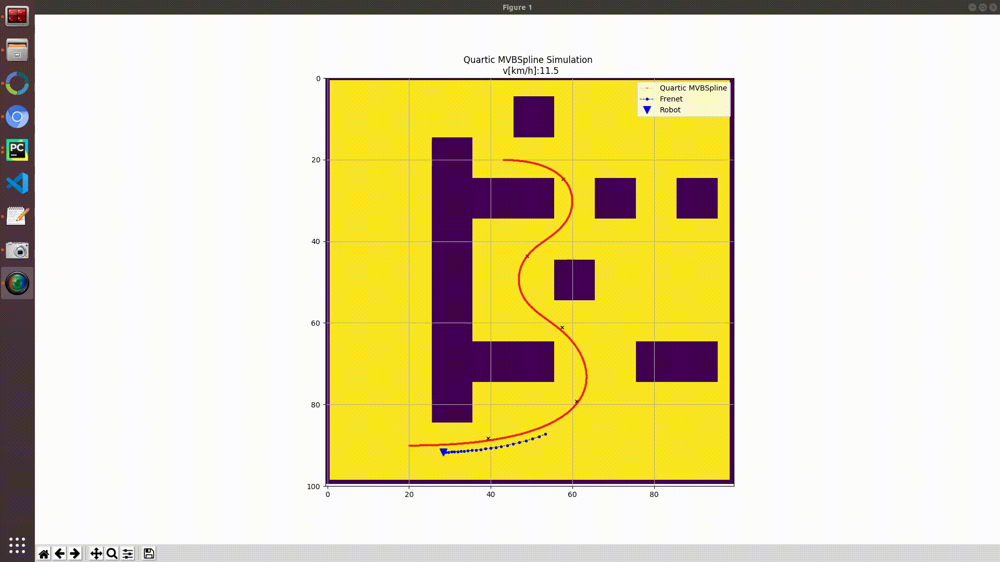

# mte544-project
Grad Project for MTE544

Authors: Somesh Daga and Aidan Keaveny

 

## Usage

If setting up for the first time, follow these instructions to run the demos:

1. Install python dependencies:
    - If using conda (install + activate environment):

            conda create env -f environment.yml
            conda activate mte544-project

    - If using pip (requires python 2.7):

            pip install -r requirements.txt

2. Navigate to the working directory of the scripts:

        cd PathPlanning
        
## Configurations

Configurations for the different scripts/modules are managed through the `config.ini` file

## Main Scripts

Run all scripts from the `PathPlanning` directory

### generate_path.py

This script creates MVB Curves in a 2D Gridmap

### plot_from_pickle.py

This script plots MVB curves and derived characteristics, stored in pickle files

### FrenetOptimalTrajectory/frenet_optimal_trajectory.py

This script performs the local planning using the Frenet planner, using splines loaded from pickle files. Special thanks to https://arxiv.org/abs/1808.10703 for providing a great starting point for the source code.